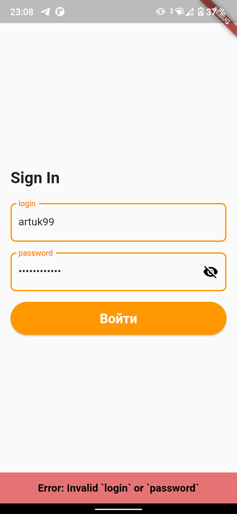

# Целевая платформа

- Версия Flutter: **3.0.5**
- Версия Dart: **2.17.6**
- Эмулятор Android: GalaxyS21 API 30

# Результаты

\* Ошибку в логике авторизации заметил только только после окончания ивента.

В качесте стейт менеджера был выбран bloc в связке с freezed. Для сохранения токена использовал secure storage.

При ошибке авторизации пользователь увидит snackbar.

В случае успешной авторизации пользователь попадает на экран со списком всех топиков. Сообщения в топике могут содержать текст, геолокацию, несколько изображений или все сразу. Для последних двух типов были добалены ChatMessageImagesDto, ChatMessageGeolocationAndImagesDto и расширена логика функции _fetchAllMessages репозитория. 